# SOC Automation Lab: EDR to SOAR Integration

This project demonstrates the implementation of an end-to-end Security Operations Center (SOC) automation pipeline. The workflow integrates LimaCharlie EDR to ingest telemetry from a Linux Ubuntu endpoint, which is then orchestrated by Tines SOAR. The automation logic performs real-time threat intelligence enrichment via the VirusTotal API, enabling the system to take automated remediation actions (such as host isolation) or alert SOC analysts via Slack for manual intervention.

## 🗺️ Project Architecture & Flow
The diagram below illustrates the flow of events, from the initial detection of an event on the Ubuntu server (endpoint) to the final remediation action:

*(Click to zoom)*

### 🛠️ Project Evolution and Iterative Development
The project was developed in two different phases, evolving from a manual response model to an automated, intelligence-driven architecture.

#### Iteration 1: Baseline Connectivity and Manual Response
Initially, the project was meant to detect **LaZagne** (a credential dumping tool) on the Ubuntu server (endpoint). The workflow established a baseline where telemetry was sent from **LimaCharlie** to **Tines**. Upon detection, the SOC was alerted via Slack and Email with a link to the **Detection**. An analyst had to manually review the alert and click "Yes" or "No" on the prompt/site within the Tines story (playbook), which then triggered the respective response and sent a confirmation message back to the team.

#### Iteration 2: More Detection Rules and VT (VirusTotal) Enrichment
I expanded the scope of detection to include **Nmap Scans** and **Unauthorized User Creation**. I then integrated the **VirusTotal (VT) API** directly into the Tines workflow to automate the decision-making process. This shifted the SOC's role from "reviewing every single alert and being the only one to isolate" to "managing exceptions," significantly reducing response times for known threats.

### 🧠 The Logic Flow
With the integration of the VirusTotal API, the Tines workflow now follows a three-tier logic check to determine the remediation path:

* **Tier 1: Known Malicious (VT Score > 3)**
    * **Action:** Immediate **Auto-Isolation** of the endpoint via the LimaCharlie API.
    * **Notification:** The SOC receives a Slack alert confirming the threat was blocked and the machine is secured.
* **Tier 2: Unknown/Suspicious (Status 404)**
    * **Action:** No automatic action is taken to prevent False Positives.
    * **Notification:** The SOC is notified of "Unknown/Suspicious" telemetry. The analyst must investigate and use the **Interactive Prompt/Page** to manually decide on isolation.
* **Tier 3: Known Clean / Administrative Tools (VT Score = 0)**
    * **Action:** No isolation.
    * **Notification:** The SOC is alerted with a "Clean" status for visibility. 
    * **Fallback:** If the analyst determines the activity is a **Zero-Day** or **False Negative** upon manual review, they retain the option to trigger isolation via the manual prompt.

## 🔍 Detection Walkthrough: Anatomy of an Alert

To demonstrate the end-to-end pipeline, I developed and tested three custom detection rules. This section illustrates how these specific events travel from the endpoint to the SOC.

### 1. The Trigger & EDR Ingestion
I simulated three distinct attack vectors on the Ubuntu endpoint to ensure the LimaCharlie agent was capturing the necessary telemetry:
* **Network Reconnaissance:** Executed `sudo nmap -A -T4 localhost`.
* **Credential Dumping:** Executed the **LaZagne** binary `sudo python3 laZagne.py all`.
* **Persistence:** Created a backdoor account using the `sudo useradd -m hacker-backdoor` command.

**Evidence:** Each of these actions was captured in the LimaCharlie **Timeline** as raw telemetry (`NEW_PROCESS` events).

Lazagne in limaCharlie timeline
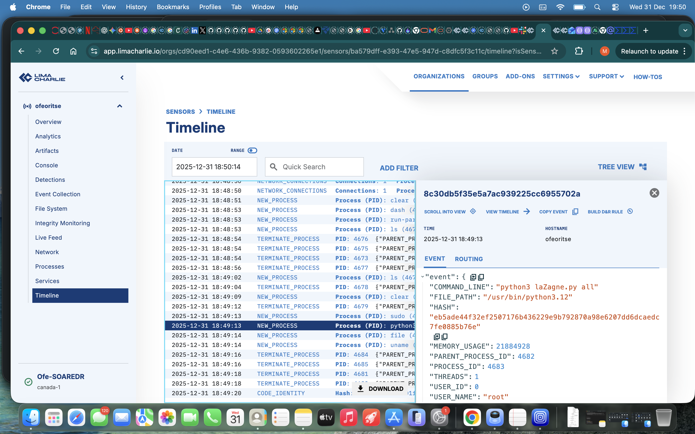

Nmap in limaCharlie timeline
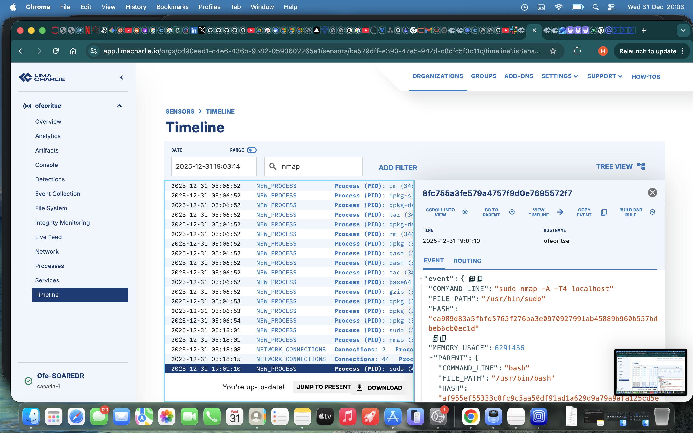

Backdoor user in limacharlie timeline
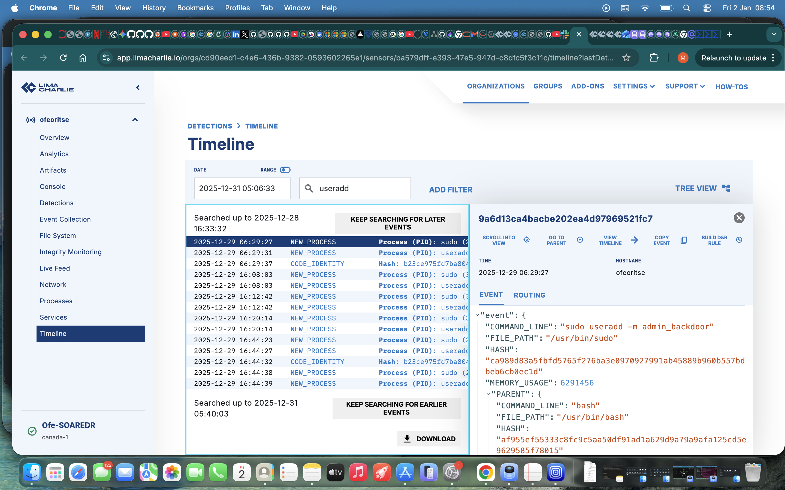

### 2. Detection & Webhook Trigger
I engineered custom **Detection & Response (D&R) Rules** to identify these patterns. Once the criteria were met, the events were promoted from raw telemetry to the **Detections** tab.
* **Rules Implemented:** 1. `Nmap Scan Detection` 
    2. `LaZagne Execution Filter` 
    3. `Unauthorized User Persistence`
  *Nmap D & R rule*
  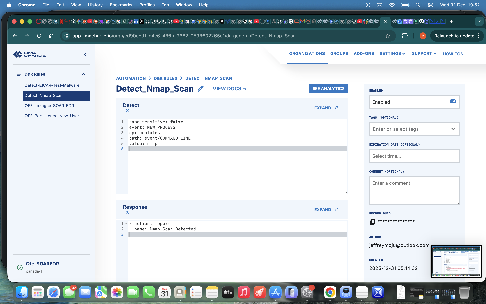

  *LaZagne D & R rule*
  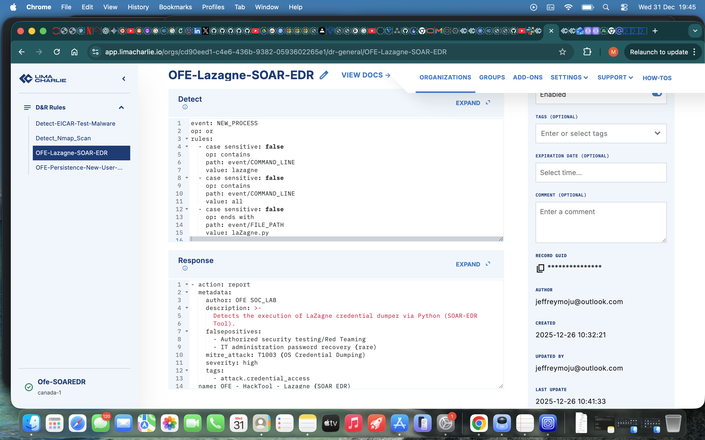

  *User Persistence D & R rule*
  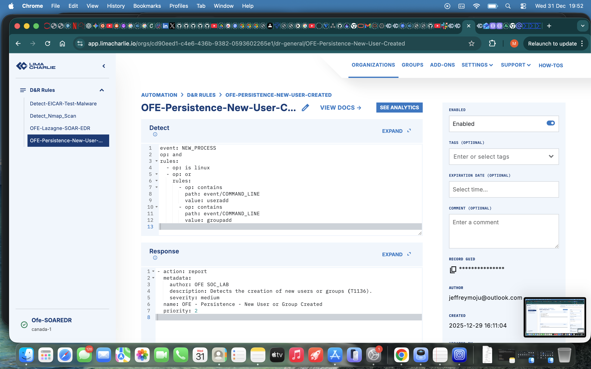
* **Action:** Upon detection, LimaCharlie automatically packaged the event metadata into a JSON payload and forwarded it to the Tines webhook for orchestration.

**Nmap Detection**
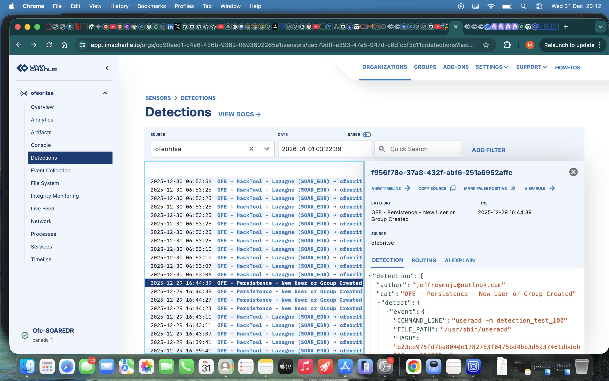

**LaZagne Detection**
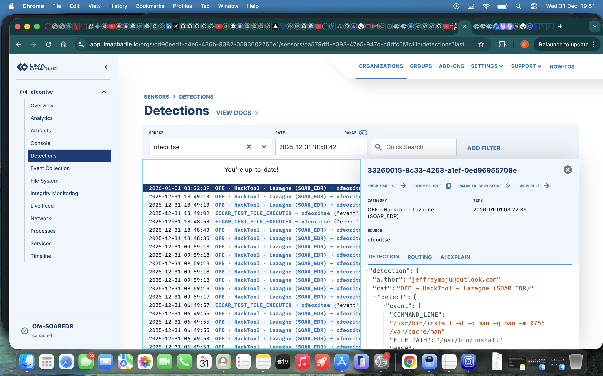

**User Persistence Detection**

### 3. SOAR Orchestration & SOC Notification
Once the payload reached **Tines**, the workflow queried the **VirusTotal API**. Since these simulated activities (like a custom Nmap scan or a local LaZagne build) often return an "Unknown" status (404), the story branched to the **Tier 2** manual review path.
* **Result:** A formatted alert was sent to the SOC via Slack and Email.
* **Analyst Action:** I utilized the **Interactive Decision Page** to review the enriched data and manually trigger host isolation where necessary.

*Tines story 404 unknown status
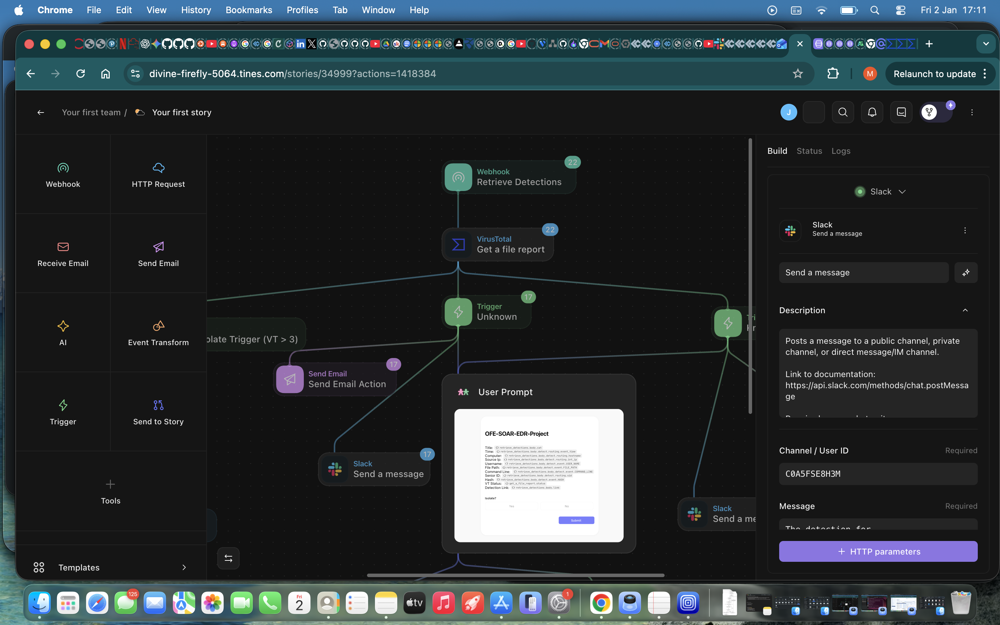
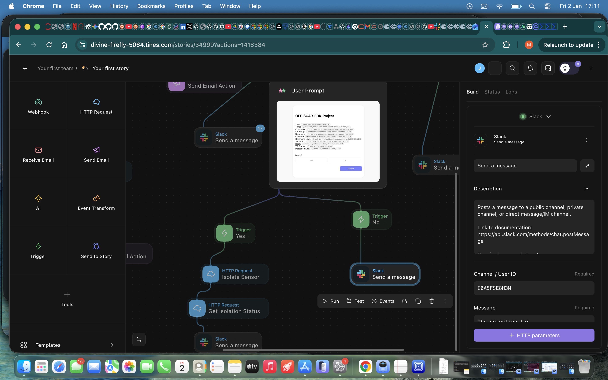

**The Analyst Decision Page (Action):**

*This is the custom interface I built where the analyst makes the final call on remediation.*

**The Slack Notification (Communication):**
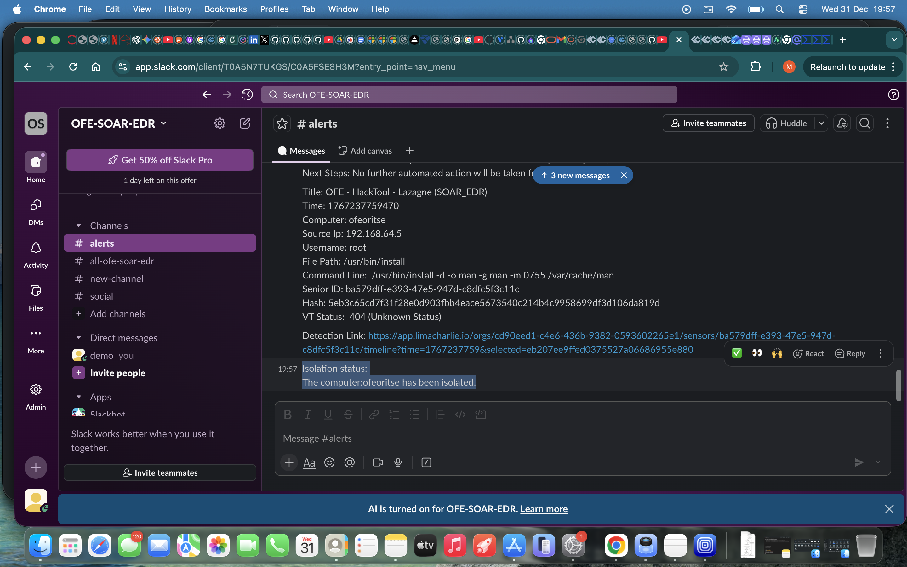
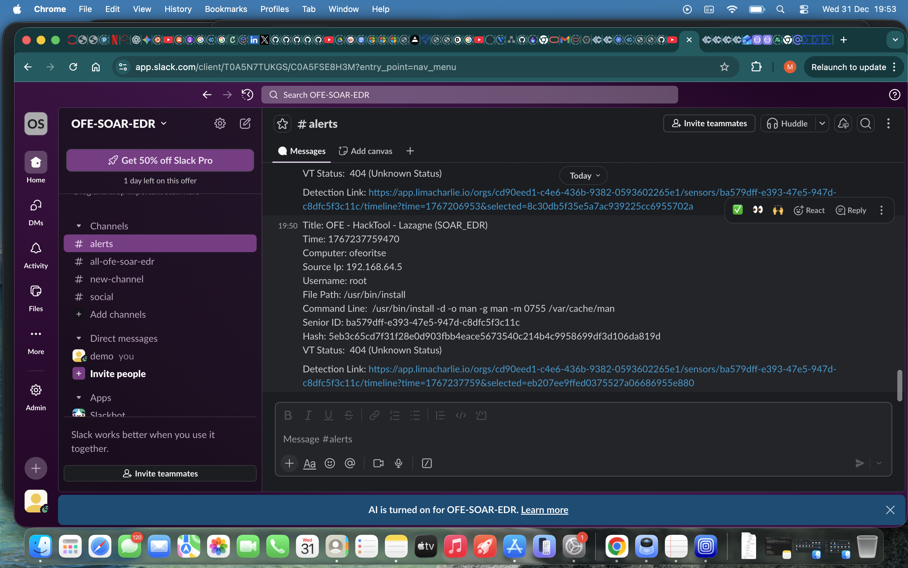
*The alert includes high-level details and a direct link to the detection page in limaCharlie.*

---

## 🧪 Specialized Logic & Unit Testing

Beyond standard alerting, I performed specific "Unit Tests" to verify the advanced automated paths within the Tines logic.

### 🔴 Case Study: Automated Remediation (Known Malicious)
To validate the **Auto-Isolation** trigger, I used an **Event Transform** node to simulate a high-threat scenario.
* **The Test:** I injected a known-malicious file hash into a detection payload.
* **The Result:** The VirusTotal score exceeded the threshold (> 3), and Tines immediately executed the **isolate** command via the LimaCharlie API. The SOC received a confirmation that the threat was mitigated automatically.

### 🟢 Case Study: False Positive Mitigation (Known Clean)
I tested the workflow against the `gpgconf` utility to ensure the system doesn't disrupt legitimate administrative work.
* **The Test:** Processed a process event for `/usr/bin/gpgconf`.
* **The Result:** VirusTotal returned a score of 0. The system flagged the event as "Clean" and logged it for visibility without prompting for isolation, successfully preventing a False Positive.

