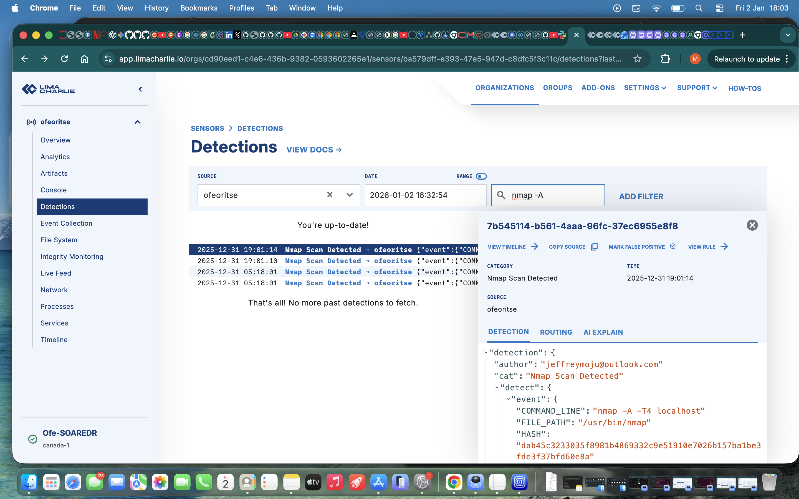
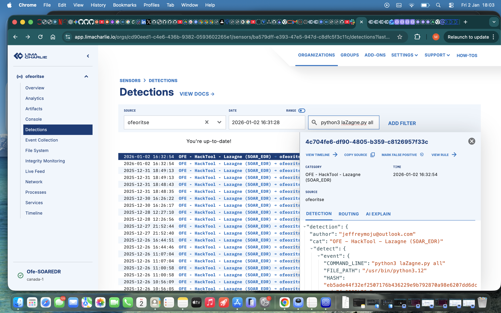
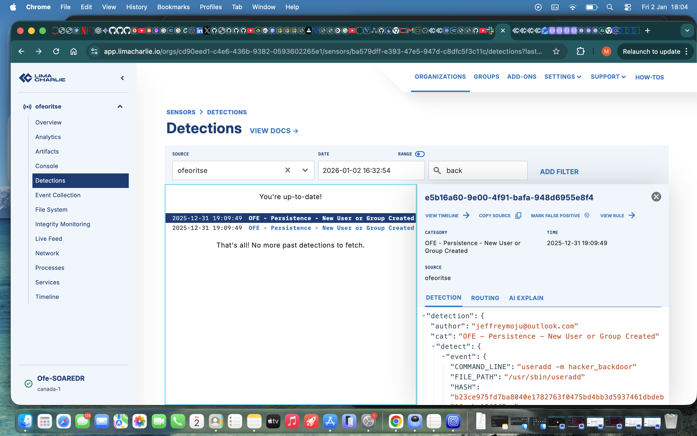
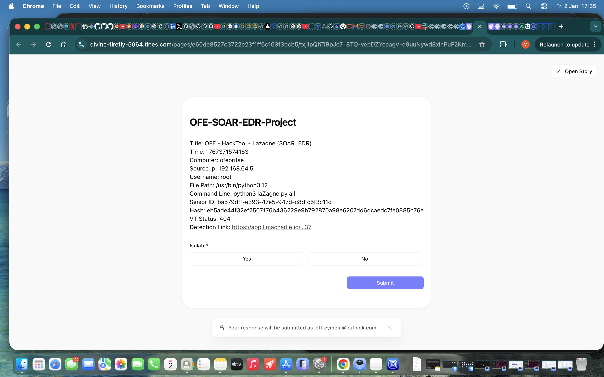
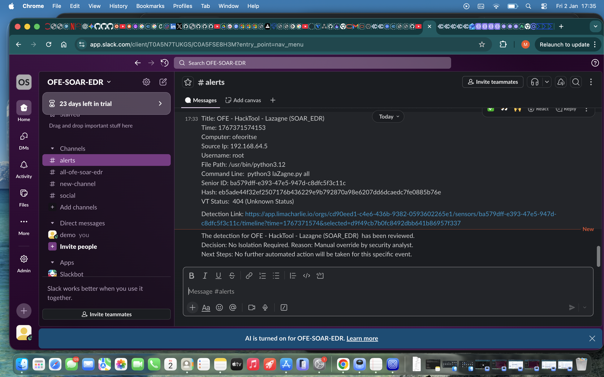
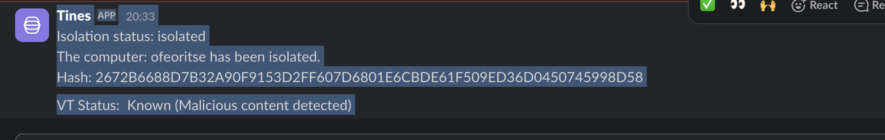
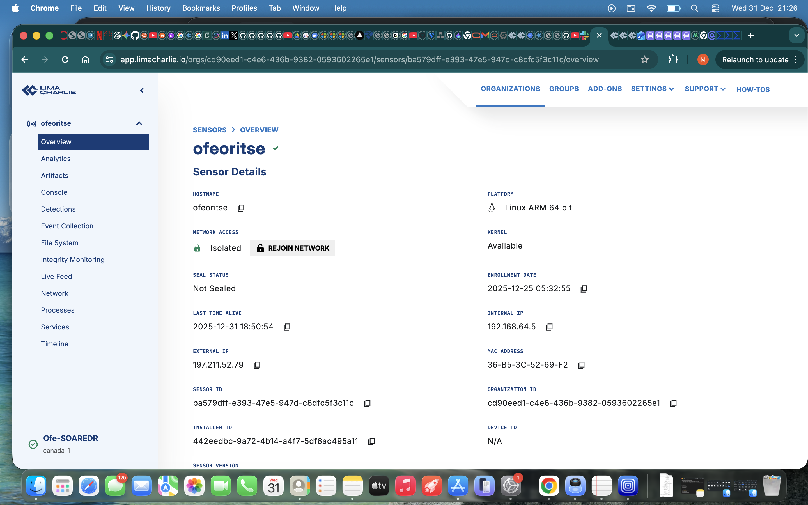
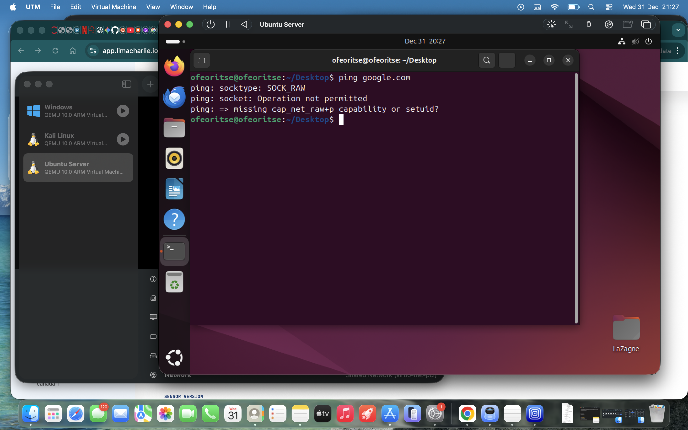
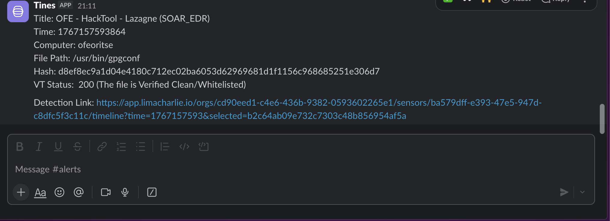
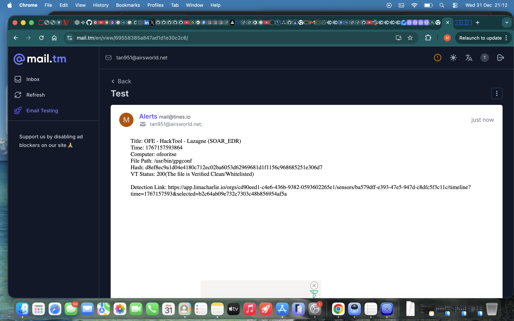

# SOC Automation Lab: EDR to SOAR Integration

This project demonstrates the implementation of an end-to-end Security Operations Center (SOC) automation pipeline. The workflow integrates LimaCharlie EDR to ingest telemetry from a Linux Ubuntu endpoint, which is then orchestrated by Tines SOAR. The automation logic performs real-time threat intelligence enrichment via the VirusTotal API, enabling the system to take automated remediation actions (such as host isolation) or alert SOC analysts via Slack for manual intervention.

## ⚠️ Lab Scope & Assumptions
This lab intentionally uses simulated attack techniques in an isolated environment. Some detections (e.g., custom LaZagne builds or local administrative tools) may return unknown threat intelligence results from VirusTotal. This behavior is expected and reflects real-world SOC challenges, where not all malicious activity is immediately classified by external threat intelligence sources.

## 🧠 Skills Demonstrated
- **EDR Telemetry Analysis:** Linux process and network monitoring.
- **Detection Engineering:** Engineering custom D&R rules in LimaCharlie.
- **SOAR Orchestration:** Playbook design and complex branching logic in Tines.
- **Threat Intelligence:** Real-time API enrichment via VirusTotal.
- **Incident Response:** Automated containment (host isolation) and analyst escalation.
- **Error Handling:** Managing API 404/401 statuses and False Positive mitigation.

## 🗺️ Project Architecture & Flow
The diagram below illustrates the flow of events, from the initial detection on the Ubuntu server to the final remediation action:

*(Click to zoom)*

---

### 🛠️ Project Evolution and Iterative Development
The project evolved through two distinct phases to move from manual intervention to intelligence-driven automation.

#### Iteration 1: Baseline Connectivity and Manual Response
Initially, the workflow established a baseline where telemetry for **LaZagne** was sent from LimaCharlie to Tines. The SOC was alerted via Slack and Email with a link to a manual prompt. An analyst had to manually click "Yes" or "No" to trigger a response.

#### Iteration 2: Advanced Detection & VT Enrichment
I expanded the scope to include **Nmap Scans** and **Unauthorized User Creation**, integrating the **VirusTotal API** to automate the decision-making process. This shifted the SOC's role from reviewing every alert to "managing exceptions," significantly reducing response times.

---

### 🧠 The Logic Flow
The Tines workflow follows a three-tier logic check to determine the remediation path:

* **Tier 1: Known Malicious (VT Score > 3)**
    * **Action:** Immediate **Auto-Isolation** via LimaCharlie API.
    * **Notification:** Slack alert confirming the threat was blocked and the machine is secured.
* **Tier 2: Unknown/Suspicious (Status 404)**
    * **Action:** No automatic action (Prevents False Positives).
    * **Notification:** Analyst is notified via Slack and must use the **Interactive Page** to decide on isolation.
* **Tier 3: Known Clean (VT Score = 0)**
    * **Action:** No isolation.
    * **Notification:** Logged as "Clean" for visibility.

---

## 🔍 Detection Walkthrough: Anatomy of an Alert

### 1. The Trigger & EDR Ingestion
I simulated three distinct attack vectors on the Ubuntu endpoint:
* **Network Reconnaissance:** `sudo nmap -A -T4 localhost`
* **Credential Dumping:** `sudo python3 laZagne.py all`
* **Persistence:** `sudo useradd -m hacker-backdoor`

**Telemetry Evidence (LimaCharlie Timeline):**

### 2. Detection & Webhook Trigger
I engineered custom **Detection & Response (D&R) Rules** to promote these events to detections.

**Rules Implemented:**
* `Nmap Scan Detection` 
* `LaZagne Execution Filter` 
* `Unauthorized User Persistence` 

**Detections Triggered:**

## 🎯 MITRE ATT&CK Mapping
* **Credential Dumping:** T1555 (LaZagne)
* **Network Service Discovery:** T1046 (Nmap)
* **Persistence via Account Creation:** T1136

### 3. SOAR Orchestration & SOC Notification
Tines queried VirusTotal. For simulated/unknown activity (404), the story branched to Tier 2.

**Tines Logic & Decision Page:**

**Slack Notification:**

---

## 🧪 Specialized Logic & Unit Testing

### 🔴 Case Study: Automated Remediation (Known Malicious)
I used an **Event Transform** node to inject a known-malicious hash and verify the Tier 1 path.

* **Result:** Tines immediately executed the **isolate** command.

**Proof of Isolation:**

*Post-isolation: Pinging google.com results in 'Operation not permitted', confirming quarantine.*

### 🟢 Case Study: False Positive Mitigation (Known Clean)
Tested against `gpgconf` to ensure legitimate work continues.
* **Result:** VT Score 0. System flagged as "Clean" and logged without isolation.

---

## 🛠️ Technical Challenges & Troubleshooting
* **Handling VirusTotal 404 Status:** Implemented conditional logic to interpret "Not Found" as "Unknown," routing them to analysts rather than allowing the playbook to error out.
* **JSON Path Mapping:** Debugged complex LimaCharlie telemetry objects using Tines events logs to correctly map `{{ .event.target.FILE_HASH }}` for API queries.

---

## 🏁 Conclusion
This lab demonstrates the power of SOAR. By automating response for "known bad" threats and filtering "known good" activity, I reduced the manual workload for the SOC, allowing focus on complex, unknown security events.
