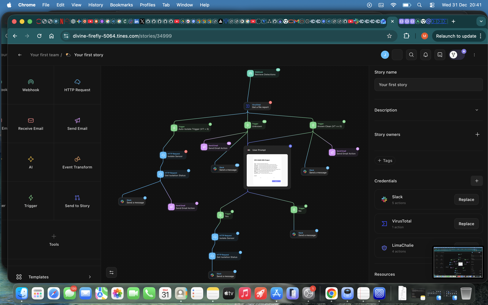

# SOC Automation Lab: EDR to SOAR Integration

This project demonstrates the implementation of an end-to-end Security Operations Center (SOC) automation pipeline. The workflow integrates LimaCharlie EDR to ingest telemetry from a Linux Ubuntu endpoint, which is then orchestrated by Tines SOAR. The automation logic performs real-time threat intelligence enrichment via the VirusTotal API, enabling the system to take automated remediation actions (such as host isolation) or alert SOC analysts via Slack for manual intervention.

## 🗺️ Project Architecture & Flow
The diagram below illustrates the flow of events, from the initial detection of an event on the Ubuntu server (endpoint) to the final remediation action:

*(Click to zoom)*

### 🛠️ Project Evolution and Iterative Development
The project was developed in two different phases, evolving from a manual response model to an automated, intelligence-driven architecture.

#### Iteration 1: Baseline Connectivity and Manual Response
Initially, the project was meant to detect **LaZagne** (a credential dumping tool) on the Ubuntu server (endpoint). The workflow established a baseline where telemetry was sent from **LimaCharlie** to **Tines**. Upon detection, the SOC was alerted via Slack and Email with a link to the **Detection**. An analyst had to manually review the alert and click "Yes" or "No" on the prompt/site within the Tines story (playbook), which then triggered the respective response and sent a confirmation message back to the team.

#### Iteration 2: More Detection Rules and VT (VirusTotal) Enrichment
I expanded the scope of detection to include **Nmap Scans** and **Unauthorized User Creation**. I then integrated the **VirusTotal (VT) API** directly into the Tines workflow to automate the decision-making process. This shifted the SOC's role from "reviewing every single alert and being the only one to isolate" to "managing exceptions," significantly reducing response times for known threats.

### 🧠 The Logic Flow
With the integration of the VirusTotal API, the Tines workflow now follows a three-tier logic check to determine the remediation path:

* **Tier 1: Known Malicious (VT Score > 3)**
    * **Action:** Immediate **Auto-Isolation** of the endpoint via the LimaCharlie API.
    * **Notification:** The SOC receives a Slack alert confirming the threat was blocked and the machine is secured.
* **Tier 2: Unknown/Suspicious (Status 404)**
    * **Action:** No automatic action is taken to prevent False Positives.
    * **Notification:** The SOC is notified of "Unknown/Suspicious" telemetry. The analyst must investigate and use the **Interactive Prompt/Page** to manually decide on isolation.
* **Tier 3: Known Clean / Administrative Tools (VT Score = 0)**
    * **Action:** No isolation.
    * **Notification:** The SOC is alerted with a "Clean" status for visibility. 
    * **Fallback:** If the analyst determines the activity is a **Zero-Day** or **False Negative** upon manual review, they retain the option to trigger isolation via the manual prompt.
